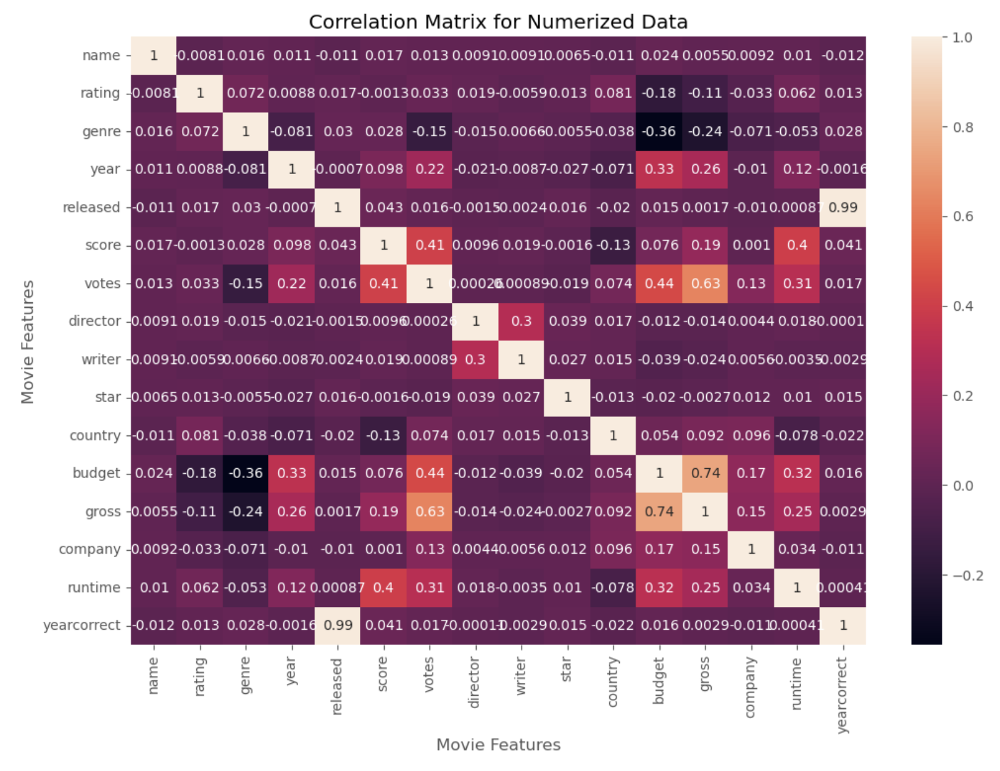

# Movie Correlation Analysis (Python)

## Project Overview

This project analyzes relationships between movie attributes such as budget, gross revenue, and other numerical features using Python.

## Libraries Used

- Pandas
- NumPy
- Matplotlib
- Seaborn

## Analysis Performed

- Data cleaning
- Correlation matrix analysis
- Feature relationship analysis
- Data visualization

## Key Insight

Movie budget has one of the strongest correlations with gross revenue.

## Example Visualization

